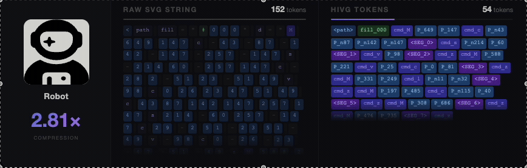

<h1>HiVG: Hierarchical SVG Tokenization</h1>

<p>
    <a href="https://hy-hivg.github.io/"></a>
    <a href="https://arxiv.org/abs/2604.05072"></a>
    <a href="https://github.com/ximinng/HiVG"></a>
    <a href="https://github.com/ximinng/HiVG/blob/main/LICENSE"></a>
</p>

This repository contains the implementation for **Hierarchical SVG Tokenization: Learning Compact Visual Programs for Scalable Vector Graphics Modeling**.
<!-- <p align="center">
    This is the official implementation of <br>
    <b>Hierarchical SVG Tokenization: Learning Compact Visual Programs for Scalable Vector Graphics Modeling</b>
</p> -->

<p align="center">
  
</p>

## Highlights

- **Small Model, Frontier Results** &mdash; 3B parameters that beat 7/7 proprietary models including GPT-5 and Gemini 2.5 on image-to-SVG.
- **Efficient SVG Token Compression** &mdash; Hierarchical tokenization (Raw SVG &rarr; Atomic tokens &rarr; Segment tokens) with 2.76x sequence compression.
- **High-Fidelity Image-to-SVG** &mdash; Convert any image into a clean, editable SVG &mdash; structure, layout, and detail faithfully preserved.

## Table of Contents

- [Installation](#installation)
- [Quick Start](#quick-start)
- [Evaluation](#evaluation)
- [Segment Token Training](#segment-token-training)
- [Generation Parameters](#generation-parameters)
- [Citation](#citation)

## Installation

```bash
git clone https://github.com/ximinng/HiVG.git
cd HiVG
pip install -e .
```

## Quick Start

### Python API

```python
from hivg_infer import HiSVGInferencePipeline

pipeline = HiSVGInferencePipeline(
    model_path="/path/to/model",
    coord_range=234,
    temperature=0.7,
    top_p=0.9,
    max_new_tokens=4096,
)

# Image-to-SVG
result = pipeline.img2svg("/path/to/photo.png")
if result["success"]:
    print(result["svg"])

# Text-to-SVG
result = pipeline.text2svg("A minimalist black phone icon with an outline style")
if result["success"]:
    with open("output.svg", "w") as f:
        f.write(result["svg"])
```

### Command Line

```bash
# Text-to-SVG
python -m hivg_infer.cli --model_path /path/to/model \
    --prompt "A minimalist black phone icon with an outline style"

# Image-to-SVG
python -m hivg_infer.cli --model_path /path/to/model \
    --image photo.png

# Batch inference
python -m hivg_infer.cli --model_path /path/to/model \
    --dataset test.json --output_dir ./outputs

# Interactive mode
python -m hivg_infer.cli --model_path /path/to/model --interactive
```

## Evaluation

<details open>
<summary><b>Batch Inference</b></summary>

```bash
# HuggingFace backend
python -m hivg_metric.eval \
    --model_path /path/to/model \
    --dataset test.json \
    --format alpaca \
    --coord_range 234 \
    --save_name results.jsonl \
    --save_svg_dir ./svgs/

# vLLM backend (faster)
python -m hivg_metric.eval \
    --model_path /path/to/model \
    --dataset test.json \
    --infer_backend vllm \
    --batch_size 32 \
    --save_name results.jsonl
```

</details>

<details>
<summary><b>Compute Metrics</b></summary>

```bash
# Text-to-SVG: CLIP score + preference metrics
python -m hivg_metric.compute_metrics \
    --input results.jsonl \
    --task_type text2svg \
    --metrics basic,clip,preference \
    --output metrics.json

# Image-to-SVG: visual similarity metrics
python -m hivg_metric.compute_metrics \
    --input results.jsonl \
    --task_type img2svg \
    --image_base_dir /path/to/images \
    --metrics basic,visual \
    --output metrics.json
```

</details>

<details>
<summary><b>Visualize Results</b></summary>

```bash
python -m hivg_metric.visualize \
    --input results.jsonl \
    --output report.html \
    --title "HiVG Evaluation Report"
```

Generates an interactive HTML report with side-by-side input / prediction / ground-truth columns.

</details>

### Supported Metrics

| Metric Group | img2svg | text2svg | Description |
|:---|:---:|:---:|:---|
| `basic` | ✓ | ✓ | Success rate, SVG length, path count |
| `visual` | ✓ | &mdash; | SSIM, LPIPS, PSNR vs. input image |
| `clip` | &mdash; | ✓ | CLIP score (text-image alignment) |
| `preference` | ✓ | ✓ | PickScore, ImageReward, HPS, Aesthetic |
| `diversity` | &mdash; | ✓ | DINOv2 / CLIP diversity (N > 1 samples) |

## Segment Token Training

HiVG's key innovation is learning **structure segment tokens** that compress SVG command sequences. See the full guide:

> **[Segment Token Training Guide](docs/segment_training.md)** &mdash; Step-by-step instructions for training BPE segments from your own SVG corpus and converting datasets.

Quick overview of the three-level tokenization:

```
Level 0 (Raw SVG)    path d="M 100 200 c -5 0 -10 5 -10 10"
                                    ↓
Level 1 (Atomic)     <cmd_M><P_100><P_200><cmd_c><d_-5><d_0><d_-10><d_5><d_-10><d_10>
                                    ↓
Level 2 (Segment)    <cmd_M><P_100><P_200><SEG_42>
```

## Generation Parameters

| Parameter | Default | Description |
|:---|:---:|:---|
| `coord_range` | 234 | Canvas coordinate range (224 canvas + margin) |
| `temperature` | 0.7 | Sampling temperature |
| `top_p` | 0.9 | Nucleus sampling threshold |
| `top_k` | 50 | Top-k sampling |
| `max_new_tokens` | 4096 | Maximum output length |
| `repetition_penalty` | 1.0 | Repetition penalty |

## Dataset Format

<details>
<summary><b>Alpaca (text2svg)</b></summary>

```json
[
  {"instruction": "Draw a red circle", "input": "", "output": "<svg tokens>"}
]
```

</details>

<details>
<summary><b>ShareGPT (img2svg)</b></summary>

```json
[
  {
    "messages": [{"role": "user", "content": "<image>Convert to SVG"}],
    "images": ["path/to/image.png"],
    "label": "<svg tokens>"
  }
]
```

</details>

## License

This project is licensed under the [MIT License](LICENSE).

## Citation

If you find HiVG useful in your research, please consider citing:

```bibtex
@article{xing2026hivg,
    title={Hierarchical SVG Tokenization: Learning Compact Visual Programs for Scalable Vector Graphics Modeling},
    author={Xing, Ximing and Xue, Ziteng and Li, Zhenxi and Liang, Weicong and Wang, Linqing and Yang, Zhantao and Hang, Tiankai and Yin, Zijin and Lu, Qinglin and Wang, Chunyu and Yu, Qian},
    journal={arXiv preprint},
    year={2026}
}
```
